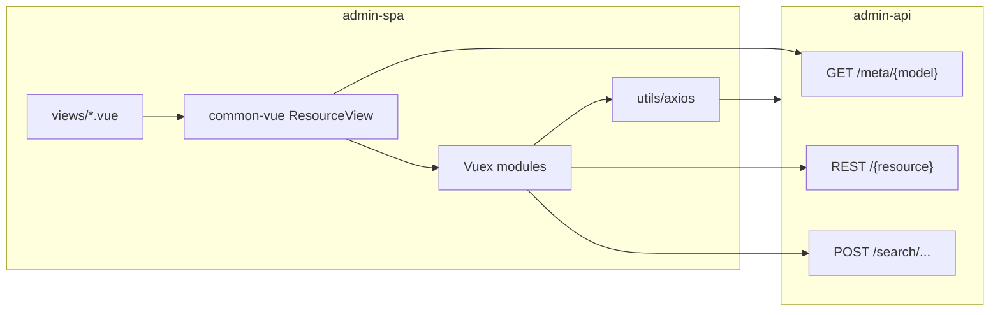

# admin-spa — Contexto del proyecto

Frontend del **panel administrativo de ComercioCity**. SPA en **Vue 3** que consume **admin-api** (JSON bajo `/api/admin`, autenticación **Laravel Sanctum** con token Bearer). Gestiona clientes desplegados, versiones del producto, actualizaciones remotas (`ClientVersionUpgrade`), leads comerciales, soporte tipo bandeja, tareas internas y configuración de IA.

**Relacionado:** [admin-api/CONTEXT.md](../admin-api/CONTEXT.md) (backend, modelos, rutas API).

---

## Stack tecnológico

| Área | Tecnología |
|------|------------|
| Framework UI | **Vue 3.5** (Options API predominante) |
| Build | **Vite 5** (`@vitejs/plugin-vue`) |
| Router | **Vue Router 4** (`createWebHistory`) |
| Estado | **Vuex 4** (módulos namespaced; **no** Pinia) |
| HTTP | **Axios 1.x** (wrapper en `src/utils/axios.js`) |
| Estilos | **Bootstrap 5.3** + **Bootstrap Icons** + **Sass** (`src/sass/_app.sass`) |
| Fechas | **moment** (store base, filtros) |
| Tiempo real | **laravel-echo** + **pusher-js** (soporte, badges, sugerencias de lead) |
| PWA | **vite-plugin-pwa** (service worker, manifest) |
| Alias | `@` → `src/` (Vite `resolve.alias`) |

**Dev server:** `localhost:8002` (`vite.config.js`).

---

## Estructura de carpetas principal

```
admin-spa/
├── public/                    # favicon, iconos PWA
├── src/
│   ├── main.js                # createApp, store, router, Echo, PWA
│   ├── App.vue                # layout: nav lateral + router-view + toasts globales
│   ├── router/
│   │   ├── index.js           # createRouter + mapeo de routes.js
│   │   ├── routes.js          # definición plana de rutas + metadatos de menú
│   │   └── guard.js           # auth guest / requiresAuth
│   ├── store/                 # módulos Vuex de dominio (+ auth, meta, general)
│   ├── views/                 # una vista por ítem de menú (orquestación)
│   ├── components/            # UI específica por dominio (support, lead, task, …)
│   ├── common-vue/            # infra reutilizable (tabla, CRUD modal, store base)
│   │   ├── components/
│   │   ├── store/
│   │   ├── mixins/
│   │   └── config/
│   ├── composables/           # sockets Echo (Vue 3 composables)
│   ├── utils/                 # axios, logger, route_string, modal_escape, …
│   └── sass/
├── .env / .env.example        # variables VITE_*
├── vite.config.js
└── package.json
```

**No existe** carpeta `src/models`: los formularios y columnas se arman desde **meta** devuelto por admin-api (`GET /meta/{model_name}` → `properties[]`).

---

## Vue Router

### Cómo se definen las rutas

1. **`src/router/routes.js`**: array exportado con `path`, `name`, `text` (menú), `component` (lazy `import()`), `meta` y opcionalmente `model_name`.
2. **`src/router/index.js`**: transforma cada entrada en ruta de Vue Router y registra `setup_guard`.
3. **`src/components/app/Nav/Index.vue`**: importa el mismo `routes.js` para renderizar el menú lateral (iconos Bootstrap Icons vía `meta.icon`).

### Estructura

- **Rutas planas** (sin `children` ni rutas anidadas).
- **Una ruta ≈ una pantalla** de listado o feature custom; **no hay rutas de detalle** (`/clientes/:id` no existe).
- El “detalle” de un recurso se abre en **modal** sobre la misma ruta.

### Rutas registradas

| Path | `name` | Vista | `meta` destacado |
|------|--------|-------|------------------|
| `/soporte` | `support` | `Support.vue` | `requiresAuth`, `nav` |
| `/tareas` | `tasks` | `Tasks.vue` | idem |
| `/task-templates` | `task_templates` | `TaskTemplates.vue` | idem |
| `/leads` | `leads` | `Leads.vue` | `model_name: lead` |
| `/versiones` | `versions` | `Versions.vue` | `model_name: version` |
| `/clientes` | `clients` | `Clients.vue` | `model_name: client` |
| `/actualizaciones` | `updates` | `Updates.vue` | `model_name: update` |
| `/reglas-seguimiento` | `followup_rules` | `FollowupRules.vue` | idem |
| `/protocolo-ventas` | `protocol_entries` | `ProtocolEntries.vue` | idem |
| `/ai-system-prompt` | `ai_system_prompt` | `AiSystemPrompt.vue` | idem |
| `/cuenta` | `account` | `Account.vue` | idem |
| `/login` | `login` | `Login.vue` | `guest: true`, sin nav |

(`Home.vue` y ruta `/` están comentadas en `routes.js`.)

### Guard de autenticación (`guard.js`)

- Rutas con `meta.guest`: si hay token → redirige a `home` (ruta comentada; conviene alinear si se rehabilita inicio).
- Rutas con `meta.requiresAuth`: sin token → `login` con `?redirect=`; con token pero sin `admin` → `dispatch('auth/me')` antes de continuar.

### Remount al re-clicar menú

`App.vue` usa `:key` en `<router-view>` compuesto por `route.name` + `general.route_reload_versions[name]`. El nav hace `commit('general/bump_route_reload')` al pulsar el ítem activo para volver a ejecutar `mounted` de la vista.

---

## Vuex — módulos

Todos los módulos en `src/store/index.js` son **namespaced**.

| Módulo | Origen | Responsabilidad |
|--------|--------|-----------------|
| `auth` | `store/auth.js` | Token Sanctum (`admin_token` en `localStorage`), login/logout/me, perfil admin |
| `meta` | `store/meta.js` | Caché de `GET /meta/{model}` → `properties` para tablas y formularios |
| `general` | `store/general.js` | Mensaje global opcional; versiones de recarga de rutas |
| `version` | `__base_store` | CRUD listado **Version** |
| `client` | `__base_store` | CRUD listado **Client** |
| `update` | `__base_store` | CRUD **ClientVersionUpgrade** (`model_name: 'update'`) |
| `lead` | `__base_store` + acciones | CRUD leads + mails, demo setup, promoción, mensajes IA |
| `demo` | `__base_store` | Catálogo de demos (modal dentro de Leads) |
| `followup_rule` | `__base_store` + `api_resource_path: followup-rule` | Reglas de seguimiento automático |
| `protocol_entry` | `__base_store` + filtros | Protocolo de ventas (`protocol-entry` en API) |
| `ai_system_prompt` | custom | GET/PUT singleton del system prompt |
| `support_ticket` | `__base_store` + inbox | Bandeja de tickets, filtros por asignación, badges no leídos |
| `support_message` | custom | Mensajes del ticket activo, envío, carga |
| `task` | `__base_store` + kanban | Tareas internas, admins, reorder |
| `task_template` | `__base_store` | Plantillas de tareas automáticas |

### Factory `__base_store` (`common-vue/store/__base_store.js`)

Patrón heredado de **empresa-spa**, adaptado a Vuex 4. Provee para cada recurso:

- Estado: `models`, `model`, paginación, `filters` / `filtered`, `selected`, `props_to_show`, `loading`, etc.
- Acciones: `get_models`, `run_filter` (`POST /search/{model}/null/1`), `delete_model`, `upsert_model_in_lists`.
- Segmento HTTP: `model_name` o `api_resource_path` (kebab-case cuando difiere, ej. `protocol-entry`).

Los módulos del dominio suelen ser un one-liner:

```js
export default __base_store({ state: { model_name: 'client', use_per_page: true } })
```

---

## Componentes base reutilizables (`common-vue`)

Infraestructura **genérica**; sin lógica de un solo dominio. Regla de extensión: `.cursor/rules/10-common-vue-extensions.mdc`.

| Componente / área | Ruta | Uso |
|-------------------|------|-----|
| **ResourceView** | `components/view/Index.vue` | Vista CRUD completa: header + tabla + filtros + modal + FAB |
| **ViewHeader** | `view/header/Index.vue` | Título, crear, selección masiva, preferencias de columnas |
| **ViewList** | `view/List.vue` | Envuelve tabla con eventos de fila |
| **DataTable** | `table/Index.vue` | Tabla declarativa según `properties` |
| **Celdas** | `table/body/cell/Index.vue` | Render por tipo de columna |
| **Filtros columna** | `table/header/column-filter/*` | Modal y campos (text, number, date, select, search, checkbox) |
| **TableFab** | `table-fab/Index.vue` | FAB para aplicar filtros acumulados |
| **ModelModal** | `model/Index.vue` | Modal CRUD: tabs por `group_title` + pestañas extra |
| **ModelForm** | `model/form/Index.vue` | Campos según `type` del meta |
| **SearchField** | `search/Index.vue` | Relaciones (`type: 'search'`) |
| **SearchModal** | `search/Modal.vue` | Búsqueda avanzada |
| **Confirm** | `confirm/Index.vue` | Diálogo de confirmación |
| **WeekDaysNav** | `previus-days/*` | Navegación por días (si se usa en filtros fecha) |

### UI propia del proyecto (`src/components/ui`)

- **`BaseModal.vue`**: modal con `teleport`, tamaños (`md`, `xl`, …), Escape y backdrop.
- **`BaseInput.vue`**: input estilizado reutilizable.

Dominios con UI no estándar viven en `src/components/{recurso}/`, típicamente `extra-props/Index.vue` conectado al modal vía `model_extra_tabs` o slot `model-extra`.

---

## Llamadas a la API

### Cliente Axios (`src/utils/axios.js`)

- `baseURL`: `import.meta.env.VITE_API_URL` (default `/api/admin`).
- Headers: `Accept` y `Content-Type` JSON.
- **Request:** adjunta `Authorization: Bearer {admin_token}` desde `localStorage`.
- **Response error:** si status ≠ 401, emite evento `admin-spa-toast` (mensaje desde `message`, `error` o `errors` de Laravel). `App.vue` muestra alertas Bootstrap fijas arriba a la derecha.

Uso típico:

```js
import api from '@/utils/axios'
api.get('/client').then(...)
api.post('/login', { email, password })
```

Los stores y componentes importan este módulo; no hay capa `fetch` ni otro cliente HTTP central aparte de llamadas puntuales en composables/sockets.

### Contratos frecuentes

| Operación | Método / path |
|-----------|----------------|
| Login | `POST /login` → `{ token, admin }` |
| Perfil | `GET /me`, `PUT /me` |
| Meta | `GET /meta/{model_name}` |
| Listado | `GET /{resource}?page=&per_page=` → `{ models: { data, last_page, total } }` o array |
| Guardar | `POST /{resource}`, `PUT /{resource}/{id}` → `{ model }` |
| Eliminar | `DELETE /{resource}/{id}` |
| Búsqueda filtrada | `POST /search/{model}/null/1` body `{ filters, per_page }` |

`route_string(model_name)` en `utils/route_string.js` devuelve el mismo string (singular); cuando el path API es kebab-case se usa `api_resource_path` en store o prop `resource_api_path` en vistas.

### Tiempo real

`main.js` instancia `window.admin_support_echo` (Echo + Pusher) si existen `VITE_PUSHER_APP_KEY` y `VITE_PUSHER_APP_CLUSTER`. Composables: `useSupportSocket`, `useSupportBadgeSocket`, `useLeadSocket`.

---

## Vista típica de “detalle” de un recurso

**No hay página de detalle por URL.** El flujo estándar es **listado + modal**.

### Patrón A — `resource-view` (Client, Update, Version, Lead, …)

Ejemplo mínimo (`Clients.vue`):

```vue
<resource-view model_name="client" />
```

Flujo al montar `ResourceView`:

1. `dispatch('meta/fetch_meta', model_name)`
2. `commit(model + '/set_props_to_show', columnas visibles)`
3. `dispatch(model + '/get_models')`
4. Clic en fila → abre `ModelModal` con `record` = fila
5. Formulario según `properties` del meta; **Guardar** → `POST` o `PUT` → `emit('saved')` → `upsert_model_in_lists`

### Ejemplo — Client (`model_name: client`)

- Ruta: `/clientes` → `Clients.vue` → solo envuelve `resource-view`.
- Store: `client` (`__base_store`).
- Detalle: modal XL con campos del meta (grupos si `group_title` en properties).

### Ejemplo — ClientVersionUpgrade (`model_name: update`)

- Ruta: `/actualizaciones` → `Updates.vue`.
- Store: `update`.
- Detalle: mismo modal CRUD + pestaña extra vía slot:

```vue
<resource-view model_name="update">
  <template #model-extra="{ record }">
    <update-extra-props :record="record" @record-updated="on_record_updated" />
  </template>
</resource-view>
```

`components/update/extra-props/` muestra pasos, seeders, comandos, tareas manuales y notificaciones; usa endpoints propios (`api`) además del guardado del formulario base.

### Patrón B — pestañas extra con componente (`model_extra_tabs`)

`Leads.vue` y `Versions.vue` definen tabs fuera de `data()` con **`markRaw(Component)`** (evita proxy de Vue 3 en `<component :is>`):

```js
const lead_model_extra_tabs = [
  { key: 'extra', label: 'Operaciones', component: markRaw(LeadExtraProps) },
  { key: 'conversation', label: 'Conversación WhatsApp', component: markRaw(LeadConversationTab) },
]
```

Scope del slot / componente extra: `{ draft, record, all_properties, model_name, parent_active_tab }`.

### Patrón C — vista custom (sin `resource-view` completo)

| Vista | Motivo |
|-------|--------|
| `Support.vue` | Bandeja master-detail (lista + conversación), no tabla meta |
| `Tasks.vue` | Kanban dos columnas + drag & drop |
| `FollowupRules.vue` | Tabla editable inline |
| `AiSystemPrompt.vue` | Editor de texto único (singleton) |
| `ProtocolEntries.vue` | Tabla custom + filtros + toggle `activa`; reutiliza `ViewHeader` + `ModelModal` |
| `Account.vue` | Preferencias del admin autenticado |

---

## Convenciones de código

| Tema | Convención |
|------|------------|
| **Naming** | `snake_case` en variables, métodos, mutaciones y acciones Vuex; inglés en identificadores |
| **API de componentes** | Nombres de componentes en PascalCase en imports; archivos en carpetas `Index.vue` |
| **Vue API** | Options API en la mayoría de SFC; **composables** solo para sockets |
| **Promesas** | `.then()` / `.catch()` en stores y servicios (sin `async/await` habitual) |
| **Iteración** | `forEach` / bucles `for` preferidos frente a `map` salvo necesidad clara |
| **Comentarios** | Español; PHPDoc/JSDoc en métodos; bloques en lógica no trivial |
| **Meta-driven UI** | Tipos de campo: `text`, `textarea`, `number`, `day`, `date`, `select`, `checkbox`, `search`, `custom`, `only_show`, `pipeline_status` |
| **Separación** | `common-vue` = genérico; `components/{recurso}/` = dominio; `views/*.vue` = orquestación |
| **Vue 3 detalles** | `markRaw` en componentes dinámicos de tabs; `teleport` en modales; sin `$root.$emit` en código nuevo (legacy en algunas vistas) |
| **Auth** | Token en `localStorage` clave `admin_token` |
| **Nav desktop** | Preferencia `admin_spa_nav_collapsed` en `localStorage` |

Alias `@/` obligatorio para imports desde `src/`.

---

## Variables de entorno relevantes

Solo nombres (valores en `.env` local, ver `.env.example`):

| Variable | Uso |
|----------|-----|
| `VITE_API_URL` | Base del API admin (incluye `/api/admin`) |
| `VITE_BACKEND_BASE_URL` | Raíz pública Laravel para `/storage/` (adjuntos soporte); opcional |
| `VITE_PUSHER_APP_KEY` | Clave Pusher para Echo |
| `VITE_PUSHER_APP_CLUSTER` | Clúster Pusher |

Variables **built-in de Vite** usadas en código (no definir en `.env` salvo despliegue):

| Variable | Uso |
|----------|-----|
| `import.meta.env.BASE_URL` | Base del history router |
| `import.meta.env.DEV` | Flag de desarrollo (`utils/logger.js`) |

---

## Mapa mental rápido



**Resumen:** pantallas por menú → en recursos CRUD, `resource-view` + meta del backend + modal; features ricas (soporte, tareas, IA) con vistas y stores dedicados; un solo cliente HTTP Axios con Sanctum y toasts globales de error.
